# 1. The Core Philosophy

Both DES and AES belong to a family called **block ciphers**. Instead of encrypting data one bit at a time (like a stream cipher), they take a fixed-size block of plaintext and transform it into a block of ciphertext.

Historically, simple encryption relied on either substitution (replacing 'A' with 'D') or transposition (shuffling the order of letters). However, using only substitution or transposition is fundamentally unsafe due to the inherent statistical nature of human language.

To solve this, DES and AES are built as product ciphers. 

>They loop data through multiple consecutive cycles—called rounds—where each round applies a combination of substitutions and transpositions. In each round, a specific sub-key (a "round key") generated from your master secret key is injected into the math.

This looping structure is designed to achieve Claude Shannon's two primary goals for a secure cipher:
- **Confusion**: Making the mathematical relationship between the key and the ciphertext as complex and non-linear as possible. If a hacker analyzes the ciphertext, they shouldn't be able to deduce anything about the key.
- **Diffusion**: Spreading the statistical structure of the plaintext across the entire ciphertext.

## Challenge

Imagine we are encrypting a 64-bit block of data with a secure block cipher. Then, we encrypt that exact same block again using the exact same key, but this time we flip just one single bit of the plaintext (from 0 to 1).

<u>Based on the concept of diffusion, what should ideally happen to the resulting ciphertext compared to the first one?</u>

Imagine we have a cup of clear water. Then add a tiny drop of red dye and stir it vigorously. The color will gradually diffuse and turn the entire glass of water pink.

Similarly, in block cipher, the stirring action is equivalent to multiple rounds of substitutions and transpositions. Claude Shannon's goal for diffusion was to ensure that the mathematical structure of the input spreads everywhere in the output. 

As a result, the flipped-bit cipher is much different from the first one. The one flipped bit enters the first round of encryption, changes a few bits. Those few bits enter the second round and change more.

# 2. The DES Architecture

DES (Data Encryption Standard) operates as a symmetric (same key for encryption - decryption between sender and receiver) key block cipher, processing data in fixed-side blocks of 64 bits using a 56-bit key.

The encryption process consists of several consecutive encryption rounds. For DES, this happens 16 times.

The genius of DES lies in its internal structure, known as a **Feistel Network**. A Feistel Network takes the 64-bit block and chops it exactly in half: both left-half and right-half are 32 bits.

## The Feistel Round

1. **The Mangler Function** (*Mixing data and key*): The right half is sent into a complex mathematical function (usually denoted as $f$) alongside a secret sub-key for that specific round. This scrambles the data based on the key.
2. **The XOR Mix** (*Combining the halves*): The output from Mangler Function is then mathematically merged with the left half using XOR.
3. **The Swap** (*Setting up the next round*): The two halves trade places. Then the original right half (which remains untouched) becomes the new left half.

<div align="center">
    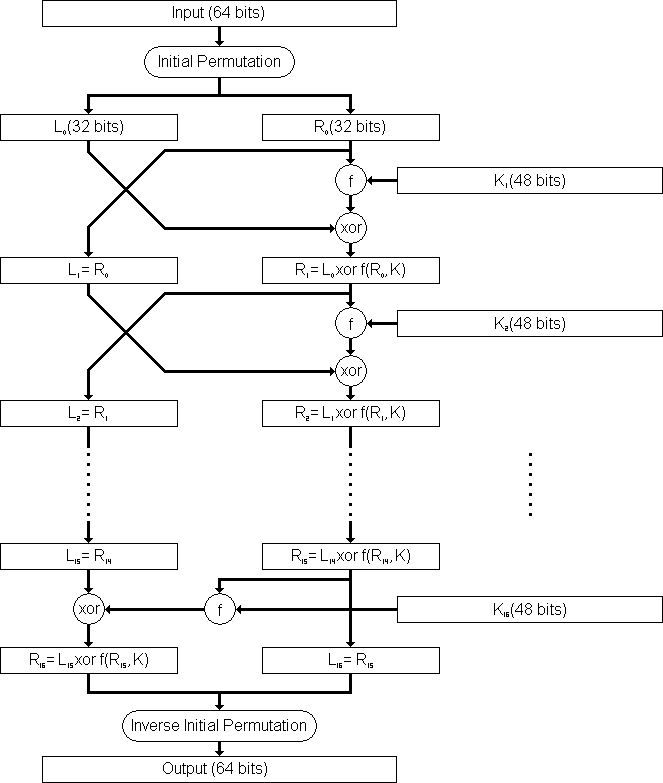
</div>

## Challenge

The mangler function $f$ is mathematically irreversible. Once the right half and the sub-key go through it, we cannot reverse-engineer the math to get the original data back.

But the receiver must be able to decrypt and read it.

<u>How can the receiver manages to decrypt the ciphertext back into plaintext?</u> (*Hint: Think about the Left/Right swap and the keys used in those 16 rounds*)

The receiver doesn't need to reverse the math of $f$ function. They simply run the ciphertext in the same 16 rounds, but this time, **use the keys in reversed order**. The XOR operation will cancle itself out, leads to unlocking the data. Magic.

## Initial Permutation (IP) and Final Permutation (FP)

Before the data even hits the Feistel network, the 64-bit plaintext goes through the IP (Initial Permutation). This simply shuffles the order of the bits according to a fixed table. After the 16 encryption rounds are finished, the FP (Final Permutation) un-shuffles them.

>FP and IP have no cryptographic significance, only for loading data into and out of data blocks (in the mid-1970s hardware mechanism)

>$FP=IP^{-1}$

**Initial Permutation Table**

<div align="center">
    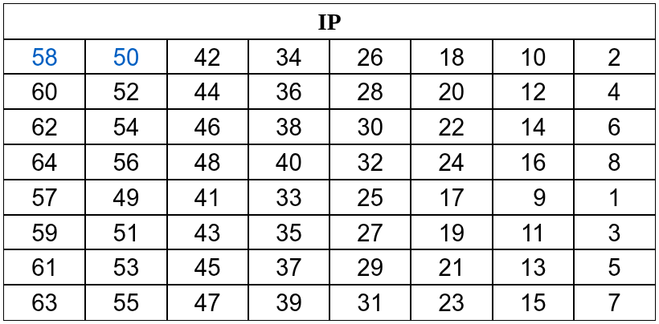
</div>

**Final Permutation Table**

<div align="center">
    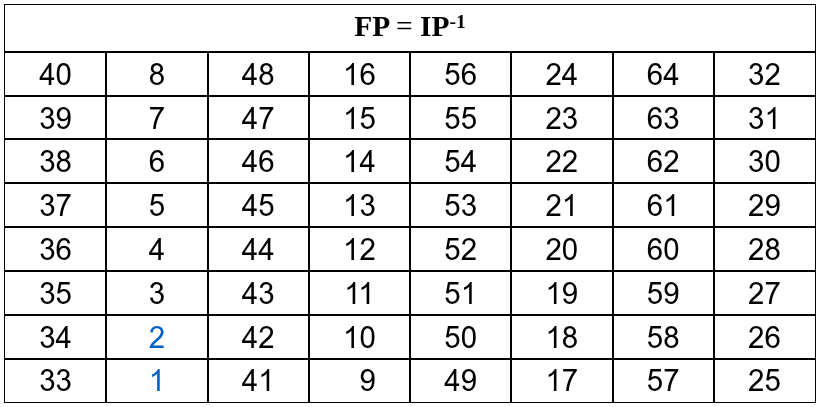
</div>

## Key Expansion and Key Schedule

**Key Expansion:** It is the way through which we get 16 subkeys of 48 bits from the initial 64 bit key for each round of DES. The generated keys will be used during the encryption of plaintext.


We start with a 64-bit key, but 8 bits are used for parity (error checking).

The key size reduces from 64 to 56 bits via permutation box PC-1.

<div align="center">
    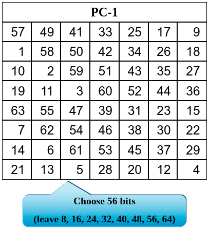
</div>

The first entry of the table is 57, means that the 57th bit of the original key $K$ becomes the first bit of the permuted key.

Next, we split the permuted keys (56 bits) into left and right halves $C0$, $D0$ of 28 bits each. Now we get 16 blocks of $Cn$, $Dn$ ($1 \leq n \leq 16$) by applying the cyclic left shifts (starting from $C0$,$D0$) based on the following rules:
- With subkey in {1, 2, 9, 16}: rotate to the left 1 position.
- With remaining: rotate to the left 2 positions.

> The rotation of $Ci$, $Di$ is based on $C_{i-1}$ and $D_{i-1}$.

Now for each pair of $Ci$, $Di$, combine them into $CiDi$ and apply permutation PC-2 to reduce from 56 bits to 48 bits.

<div align="center">
    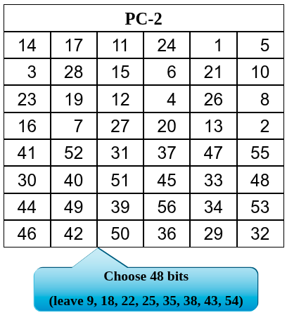
</div>

Finally, we have 16 sub-keys to schedule for each round.

## Inside the Mangler Function (Function $f$ of DES)

When the right half (32-bit) enters the $f$ function, it goes through 4 stages:
1. **The Expansion (E-Box):** Here, we will XOR the 32-bit data and the sub-key (48-bit). Since they don't match in size, the E-Box takes the 32-bit and expands them to 48 bits.
2.  **The Mix:** The 48-bit expanded data is XOR with the round key.
3. **The S-boxes (Substitution):** The 48 bits are chopped into eight separate 6-bit chunks. Each chunk goes into its own specific S-box (from S1 to S8). Each S-box is a lookup table that receives 6-bit input and output 4 bits. So that 8 boxes produce 32 bits to XOR against the left half of original data. The lookup process for S-box is as follow:
    - Suppose the input bits is *abcdef*.
    - The row to lookup would be calculated by combining first and last bit: *af*
    - The column to lookup is combination of remaining bits: *bcde*
4. **The P-box (Permutation)**: Finally, those resulting 32-bits are shuffled one last time before exiting the $f$ function to be XOR against the left half of original data.

**E-Box**

<div align="center">
    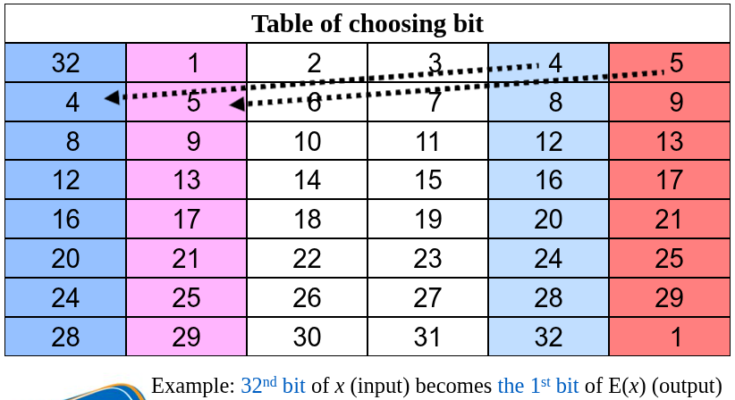
</div>

**S-boxes**

<div align="center">
    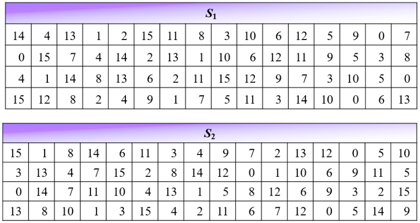
</div>

<div align="center">
    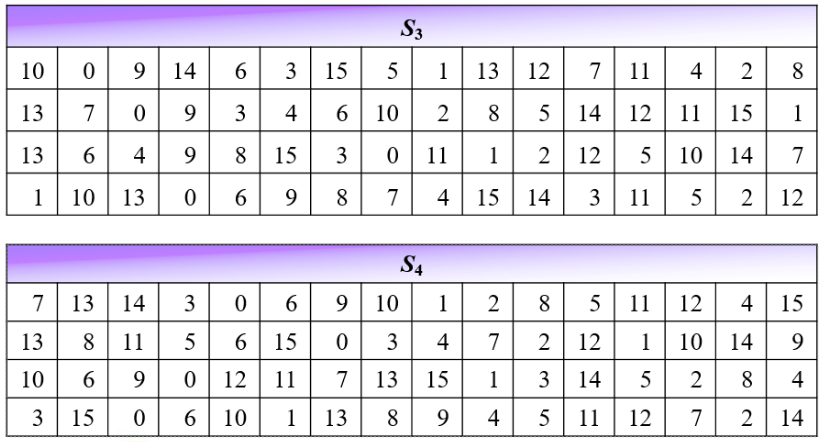
</div>

<div align="center">
    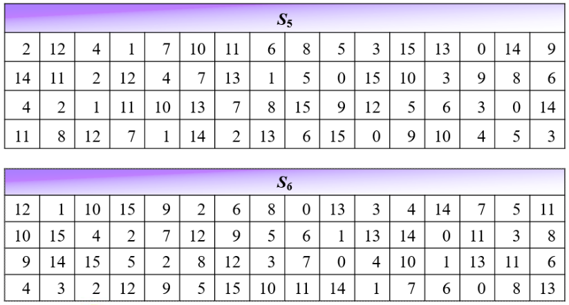
</div>

<div align="center">
    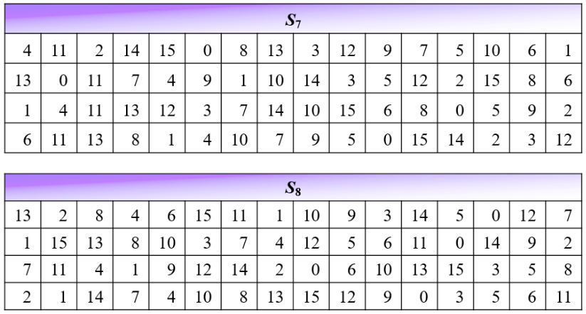
</div>

**P-box**

<div align="center">
    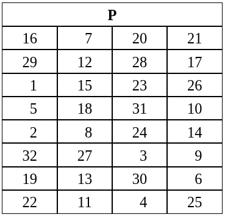
</div>

## Weakness of DES

DES had one fatal flaw: **The key was too short**.

With strong computers nowadays, the short 56-bit key is vulnerable to brute-force attack.

# 3. The AES Architecture

AES (Advanced Encryption Standard) was designed as a direct response to DES's fatal flaw. In 1997, NIST ran an open competition to find a replacement. In 2001, the **Rijndael** algorithm — created by Belgian cryptographers Joan Daemen and Vincent Rijmen — was selected and standardized as AES.

The improvements over DES are immediate and significant:

| Property | DES | AES |
|---|---|---|
| Block size | 64 bits | 128 bits |
| Key size | 56 bits | 128, 192, or 256 bits |
| Rounds | 16 | 10 / 12 / 14 |
| Structure | Feistel Network | Substitution-Permutation Network |

But the most fundamental change is structural. DES used a **Feistel Network**, where only half the data is transformed each round and the other half is carried untouched. AES uses a completely different design: a **Substitution-Permutation Network (SPN)**, where the **entire block** is transformed in every single round.

## The State Matrix

AES doesn't think of its 128-bit block as a flat sequence of bits. Instead, it loads the 16 bytes of plaintext into a **4×4 grid of bytes** — called the **State**.

$$
\text{State} =
\left[
\begin{array}{cccc}
b_0 & b_4 & b_8  & b_{12} \\
b_1 & b_5 & b_9  & b_{13} \\
b_2 & b_6 & b_{10} & b_{14} \\
b_3 & b_7 & b_{11} & b_{15}
\end{array}
\right]
$$

Each cell holds one byte (8 bits). 4 columns × 4 rows × 8 bits = 128 bits total. The bytes are filled in **column by column**.

This grid is not just a visual trick. Every single operation in AES is defined in terms of this matrix structure, and that structure is what makes diffusion so fast and powerful.

## The AES Round

Each round of AES applies four operations to the State in sequence. The only exception is the **final round**, which skips one of the four steps (more on that later).

<div align="center">
    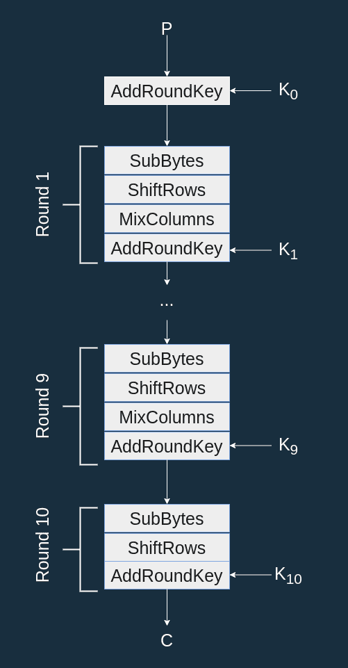
</div>

### 1. SubBytes (Substitution → Confusion)

Every byte in the 4×4 State is independently replaced using a fixed lookup table called the **AES S-box**. You put in one byte value, you get a different byte value out. All 16 bytes are substituted simultaneously.

<div align="center">
    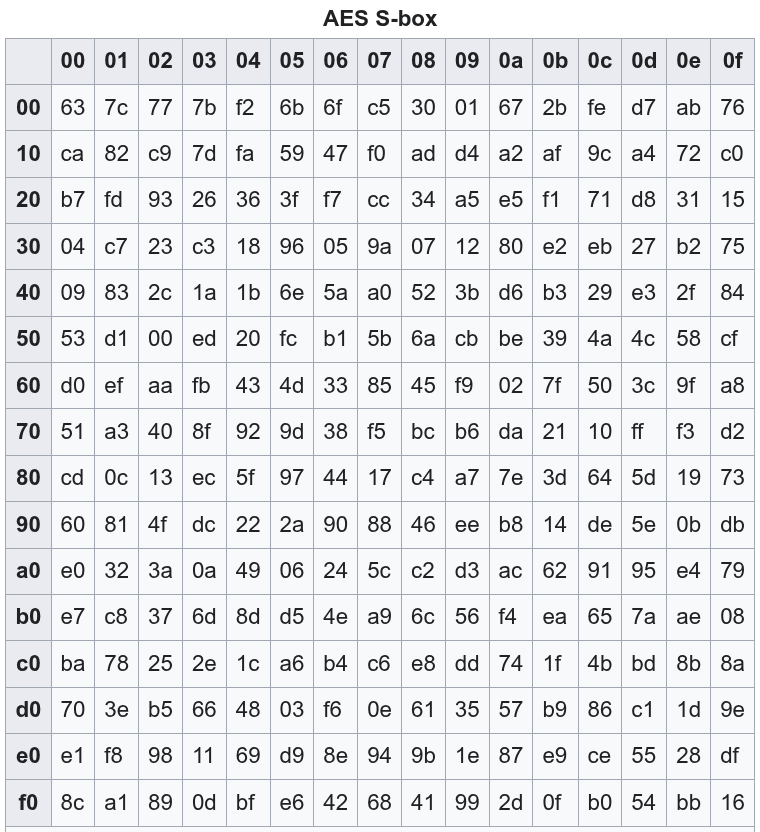
</div>

The AES S-box is the source of **non-linearity** in the cipher. It was mathematically constructed — using multiplicative inverses in a Galois Field — to be as non-linear as possible. This is what achieves **confusion**: the relationship between the key and the ciphertext becomes extremely difficult to analyze.

> Crucially, every byte is substituted *independently* in this step. SubBytes does not mix bytes across the grid — that is the job of the next two operations.

### 2. ShiftRows (Permutation → Diffusion, Part 1)

After SubBytes, the rows of the State are cyclically shifted to the left:
- **Row 0**: No shift
- **Row 1**: Shift left by 1 position
- **Row 2**: Shift left by 2 positions
- **Row 3**: Shift left by 3 positions

$$
\left[
\begin{array}{cccc}
s_{0,0} & s_{0,1} & s_{0,2} & s_{0,3} \\
s_{1,0} & s_{1,1} & s_{1,2} & s_{1,3} \\
s_{2,0} & s_{2,1} & s_{2,2} & s_{2,3} \\
s_{3,0} & s_{3,1} & s_{3,2} & s_{3,3}
\end{array}
\right]
\rightarrow
\left[
\begin{array}{cccc}
s_{0,0} & s_{0,1} & s_{0,2} & s_{0,3} \\
s_{1,1} & s_{1,2} & s_{1,3} & s_{1,0} \\
s_{2,2} & s_{2,3} & s_{2,0} & s_{2,1} \\
s_{3,3} & s_{3,0} & s_{3,1} & s_{3,2}
\end{array}
\right]
$$

This is the first step toward **diffusion**. After SubBytes, each byte holds substituted data. ShiftRows ensures that bytes from the same column are now scattered across *different* columns. This prepares them for the next operation, where each column is mixed.

### 3. MixColumns (Linear Mixing → Diffusion, Part 2)

This is the most mathematically intense operation. Each column of the State is treated as a 4-byte vector and multiplied by a fixed 4×4 matrix. The arithmetic is performed in **GF(2⁸)** — a finite field — not regular integer math.

Perform multiplication: $s'(x) = a(x) \oplus s(x)$, with $a(x) = \{03\}x^3 + \{01\}x^2 + \{01\}x + \{02\}$.

$$
\begin{aligned}
\left[
\begin{array}{c}
s_{0}\\
s_{1}\\
s_{2}\\
s_{3}
\end{array}
\right]
&=
\left[
\begin{array}{cccc}
2 & 3 & 1 & 1\\
1 & 2 & 3 & 1\\
1 & 1 & 2 & 3\\
3 & 1 & 1 & 2
\end{array}
\right]
\left[
\begin{array}{c}
s_{0}\\
s_{1}\\
s_{2}\\
s_{3}
\end{array}
\right]
\end{aligned}
$$

The result is powerful: every output byte in a column depends on *all four* input bytes of that column. Combined with ShiftRows scattering bytes across columns, a single flipped input bit will cascade and affect every byte in the entire State after just **2 rounds**. This is called the **avalanche effect**.

> MixColumns is **skipped in the final round**. At that point, the diffusion work is already done — there are no more rounds for it to feed into. Keeping it would cost computation without adding security.

### 4. AddRoundKey (Key Injection)

Finally, the current State is XOR'd byte-by-byte with the **round key** — a 128-bit sub-key derived from the original key via the Key Schedule.

> Remember: the size of a Round Key is always the size of the state

<div align="center">
    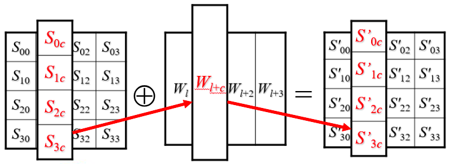
</div>

XOR is its own inverse: $A \oplus K \oplus K = A$. So to decrypt, the receiver simply XORs the same round key again. But to do this correctly, they must apply the round keys in **reverse order**, just like DES.

## The Full AES Encryption Flow

Putting it all together, the complete AES encryption process is:

1. **Initial step**: AddRoundKey with the original key (round key 0)
2. **Rounds 1 to N−1**: SubBytes → ShiftRows → MixColumns → AddRoundKey
3. **Final Round N**: SubBytes → ShiftRows → AddRoundKey *(no MixColumns)*

Where $N = 10$ for 128-bit keys, $N = 12$ for 192-bit keys, $N = 14$ for 256-bit keys.

## Challenge

In DES, the Feistel Network only transforms half the data per round, yet DES requires 16 rounds. In AES, the entire 128-bit State is transformed every round.

<u>Why does AES only need 10 rounds (for a 128-bit key) to be considered secure, while DES needs 16 rounds despite having a smaller block?</u>

The answer is MixColumns. Because every byte in a column gets mixed with every other byte in that column, and ShiftRows ensures bytes from different columns interact, a single changed byte spreads across the *entire* State in just 2 rounds. By round 4, every output bit depends on every input bit — full diffusion is achieved. DES's Feistel structure is more conservative: it only transforms half the block each round and carries the other half forward untouched, so more rounds are needed to reach the same level of mixing.

## AES Key Schedule

AES needs one 128-bit round key for the initial step, plus one for each of the N rounds — that's 11 round keys for AES-128. The Key Schedule expands the original 128-bit key into all of these.

The key is first split into 4 words of 32 bits each: $W[0], W[1], W[2], W[3]$. These are the first round key. The remaining words are generated one at a time:

- If $i$ is **not** a multiple of 4: $W[i] = W[i-1] \oplus W[i-4]$
- If $i$ **is** a multiple of 4 (start of a new round key): $W[i] = g(W[i-1]) \oplus W[i-4]$

The function $g$ is applied at every "boundary" between round keys. It consists of three sub-steps:

1. **RotWord**: Cyclically rotate the 4 bytes of the word one position to the left. It takes a 4-byte word $[a_0, a_1, a_2, a_3]$ and returns $[a_1, a_2, a_3, a_0]$.
2. **SubWord**: Pass each of the 4 bytes through the AES S-box. It takes a 4-byte word $[a_0, a_1, a_2, a_3]$ and applies AES S-Box to each of the byte to produce a new 4-byte word $[b_0, b_1, b_2, b_3]$.
3. **XOR with Rcon**: XOR the first byte with a **round constant** $\text{Rcon}[i]$

<div align="center">
    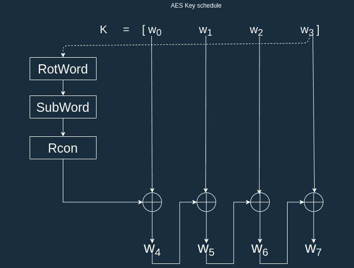
</div>

The round constants are powers of 2 computed in GF(2⁸):

| $i$ | 1 | 2 | 3 | 4 | 5 | 6 | 7 | 8 | 9 | 10 |
| --- | --- | --- | --- | --- | --- | --- | --- | --- | --- | --- | 
| $rc_i$ | 01 | 02 | 04 | 08 | 10 | 20 | 40 | 80 | 1B | 36 |

> The Rcon values break the symmetry between rounds. Without them, identical columns in the key could produce identical round keys, creating patterns that an attacker could exploit. Rcon ensures every round key is unique.

## Challenge

The AES final round drops MixColumns. DES's IP and FP also add no cryptographic value — they existed for 1970s hardware reasons.

<u>Does dropping MixColumns in the final round weaken AES?</u>

No. MixColumns creates diffusion *between* rounds — it prepares the State so that differences spread further in the *next* round. After the final SubBytes and ShiftRows, there is no next round to benefit from that diffusion. Keeping it would only add computation cost with zero security gain. There is a deeper reason too: removing MixColumns from the final round makes the decryption algorithm structurally symmetric and more efficient to implement, because the inverse operations align cleanly.

## Why AES is Considered Secure

AES has been in use since 2001 and remains unbroken against full-round attacks in practice. Its security comes from multiple layers:

- **Key size**: 128, 192, or 256 bits make brute force computationally infeasible for the foreseeable future
- **Non-linearity (SubBytes)**: The S-box is deliberately engineered to resist differential and linear cryptanalysis
- **Fast, full diffusion (ShiftRows + MixColumns)**: Every output bit depends on every input bit within just a few rounds — much faster than DES's Feistel structure
- **Strong key mixing (AddRoundKey + Key Schedule)**: Every round key is unique and the schedule itself uses the S-box, making it hard to work backwards from partial key knowledge
- **No known structural weakness**: Unlike the Feistel Network's "untouched half," the SPN structure of AES transforms the entire block uniformly every round

# 4. Polynomial Arithmetic and Galois Fields

When we described MixColumns in AES, we said it performs "multiplication in GF(2⁸)." This section unpacks exactly what that means.

## Why AES Needs a Special Kind of Math

Consider a simple problem: AES's MixColumns multiplies bytes together. But the product of two bytes (8-bit values, range 0–255) can easily exceed 255, producing a 9-bit or larger result. That no longer fits in a byte, and the math stops being cleanly reversible.

The solution is to do arithmetic inside a **finite field** — a mathematical structure with a fixed, closed set of elements where addition and multiplication always stay within the set, and every non-zero element has a multiplicative inverse.

The field AES uses is **GF(2⁸)** — read as "the Galois Field of 2 to the power 8." Its 256 elements map perfectly to the 256 possible byte values.

But to understand GF(2⁸), we first need to understand its foundation: **GF(2)** and polynomials over it.

## GF(2): The Binary Field

GF(2) is the simplest possible field. It has only two elements: **{0, 1}**.

The arithmetic rules are:

**Addition in GF(2)** (think: XOR)

| + | 0 | 1 |
|---|---|---|
| **0** | 0 | 1 |
| **1** | 1 | 0 |

**Multiplication in GF(2)** (think: AND)

| × | 0 | 1 |
|---|---|---|
| **0** | 0 | 0 |
| **1** | 0 | 1 |

The key insight from the addition table: **1 + 1 = 0**, not 2. There is no carrying, no borrowing. Every coefficient in GF(2) is either 0 or 1, and they combine with XOR.

## Representing Binary Strings as Polynomials

A binary string is naturally interpreted as a polynomial whose coefficients are elements of GF(2). The bit at position $i$ (counting from the right, starting at 0) becomes the coefficient of $x^i$.

**Example:** Convert `10011` to a polynomial.

```
Position:  4  3  2  1  0
Bit:       1  0  0  1  1
```

$$\texttt{10011} \longrightarrow x^4 + x + 1$$

**Example:** Convert `1101011011` to a polynomial.

```
Position:  9  8  7  6  5  4  3  2  1  0
Bit:       1  1  0  1  0  1  1  0  1  1
```

$$\texttt{1101011011} \longrightarrow x^9 + x^8 + x^6 + x^4 + x^3 + x + 1$$

Going backwards is just as mechanical: read the exponents and place a 1 at each corresponding bit position, 0 everywhere else.

## Polynomial Addition over GF(2)

Polynomial addition in GF(2) is done term by term, applying the GF(2) addition rule (XOR) to the coefficients of matching degree.

**Example:** Add `1101` and `1011`.

$$\texttt{1101} \longrightarrow x^3 + x^2 + 1$$
$$\texttt{1011} \longrightarrow x^3 + x + 1$$

Add coefficient by coefficient:

| Degree | $x^3$ | $x^2$ | $x^1$ | $x^0$ |
|---|---|---|---|---|
| First  | 1 | 1 | 0 | 1 |
| Second | 1 | 0 | 1 | 1 |
| **XOR**    | **0** | **1** | **1** | **0** |

Result: $x^2 + x$ → `0110`

> Notice that subtraction is **identical** to addition in GF(2). Since $-1 \equiv 1 \pmod{2}$, adding and subtracting are the same operation: XOR. This is why you can treat the "minus" in polynomial long division as XOR.

## Polynomial Multiplication over GF(2)

Multiplication follows the normal rules of polynomial multiplication, except that whenever two coefficients multiply, you use GF(2) AND, and when you sum up terms of the same degree, you use GF(2) addition (XOR).

**Example:** Multiply `101` by `11`.

$$\texttt{101} \longrightarrow x^2 + 1$$
$$\texttt{11} \longrightarrow x + 1$$

$$(x^2 + 1)(x + 1) = x^3 + x^2 + x + 1$$

No coefficient exceeded 1, so nothing needed to be reduced mod 2. The result is `1111`.

**Example with reduction:** Multiply `11` by `11`.

$$(x + 1)(x + 1) = x^2 + x + x + 1 = x^2 + 2x + 1$$

In GF(2), the coefficient 2 reduces to 0, giving:

$$x^2 + 0 \cdot x + 1 = x^2 + 1 \longrightarrow \texttt{101}$$

## Polynomial Division over GF(2)

Division works exactly like integer long division, but every subtraction step is replaced with XOR. You stop when the **degree of the current remainder falls below the degree of the divisor**.

The general form is:

$$A(x) = Q(x) \cdot B(x) + R(x)$$

where $A$ is the dividend, $B$ is the divisor, $Q$ is the quotient, and $R$ is the remainder with $\deg(R) < \deg(B)$.

### Step-by-step process

1. Align the leading term of the divisor under the leading term of the current dividend.
2. The quotient term is the ratio of those two leading terms.
3. Multiply the entire divisor by that quotient term.
4. XOR the result with the current dividend to eliminate the leading term.
5. The result becomes the new "current dividend." Repeat from step 1.
6. Stop when the degree of what remains is less than the degree of the divisor.

## Challenge

<u>Dividing `1101011011` by `10011` — what is the remainder?</u>

**Step 0: Convert to polynomials.**

$$A(x) = x^9 + x^8 + x^6 + x^4 + x^3 + x + 1 \quad (\texttt{1101011011})$$
$$B(x) = x^4 + x + 1 \quad (\texttt{10011})$$

The degree of $A$ is 9, the degree of $B$ is 4, so the quotient will have degree $9 - 4 = 5$.

---

**Step 1:** Leading term of current dividend is $x^9$.

Quotient term: $x^9 \div x^4 = x^5$

Multiply divisor by $x^5$:
$$x^5 \cdot (x^4 + x + 1) = x^9 + x^6 + x^5 \quad (\texttt{1001100000})$$

XOR with current dividend:
```
  1 1 0 1 0 1 1 0 1 1   (x^9 + x^8 + x^6 + x^4 + x^3 + x + 1)
⊕ 1 0 0 1 1 0 0 0 0 0   (x^9 + x^6 + x^5)
= 0 1 0 0 1 1 1 0 1 1
```

New remainder: $x^8 + x^5 + x^4 + x^3 + x + 1$ → `0100111011`

---

**Step 2:** Leading term is now $x^8$.

Quotient term: $x^8 \div x^4 = x^4$

Multiply divisor by $x^4$:
$$x^4 \cdot (x^4 + x + 1) = x^8 + x^5 + x^4 \quad (\texttt{100110000})$$

XOR with current remainder (aligned from degree 8):
```
  1 0 0 1 1 1 0 1 1   (x^8 + x^5 + x^4 + x^3 + x + 1)
⊕ 1 0 0 1 1 0 0 0 0   (x^8 + x^5 + x^4)
= 0 0 0 0 0 1 0 1 1
```

New remainder: $x^3 + x + 1$ → `1011`

---

**Stop:** $\deg(x^3 + x + 1) = 3 < \deg(x^4 + x + 1) = 4$. Division is complete.

$$\boxed{\text{Remainder} = x^3 + x + 1 = \texttt{1011}}$$

The quotient is $x^5 + x^4$ → `110000`.

**Verification:** $(x^5 + x^4)(x^4 + x + 1) + (x^3 + x + 1)$
$= x^9 + x^6 + x^5 + x^8 + x^5 + x^4 + x^3 + x + 1$
$= x^9 + x^8 + x^6 + \cancel{2x^5} + x^4 + x^3 + x + 1$
$= x^9 + x^8 + x^6 + x^4 + x^3 + x + 1$ ✓

## GF(2⁸): The Field Inside AES

GF(2⁸) extends GF(2) to a field with $2^8 = 256$ elements. Each element is a polynomial of degree **at most 7** with coefficients in GF(2) — which maps one-to-one onto the 256 possible byte values.

**Addition** in GF(2⁸) is still just XOR — nothing changes.

**Multiplication** in GF(2⁸) is where the key difference appears. When you multiply two polynomials, the result can have degree up to 14, which no longer fits in a byte. To bring it back into the field, you reduce it **modulo an irreducible polynomial** of degree 8.

AES uses the following irreducible polynomial (chosen by the designers for efficiency on hardware):

$$m(x) = x^8 + x^4 + x^3 + x + 1 \quad (\texttt{100011011})$$

"Irreducible" means $m(x)$ cannot be factored into lower-degree polynomials over GF(2) — just like a prime number cannot be factored into smaller integers. This guarantees that the field structure is mathematically sound and every non-zero element has a unique multiplicative inverse.

**So multiplication in GF(2⁸) is:**
$$A(x) \cdot B(x) \pmod{m(x)}$$

Multiply normally over GF(2), then divide by $m(x)$ and take the remainder.

This is exactly the operation inside AES's **MixColumns** (the matrix entries 02 and 03 mean "multiply by $x$" and "multiply by $x+1$" in GF(2⁸)) and the **SubBytes S-box** (which computes multiplicative inverses in GF(2⁸)).

> The polynomial division procedure you practiced above is exactly how you compute a multiplication result modulo $m(x)$. The remainder after dividing by $m(x)$ is the final product, guaranteed to have degree ≤ 7 and therefore fit in one byte.
