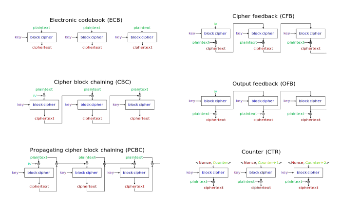
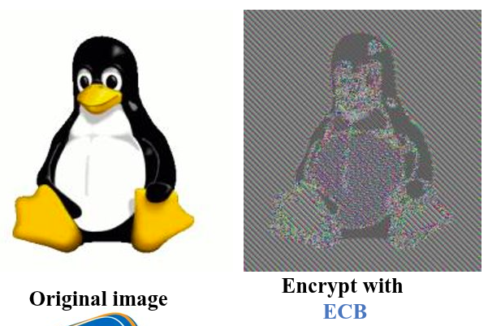
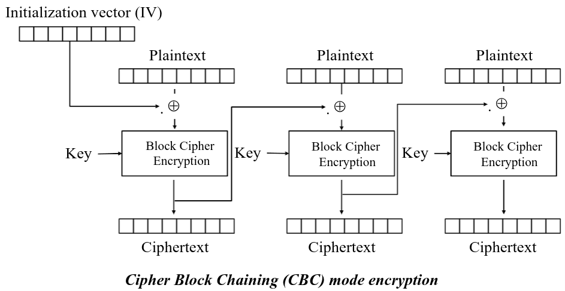
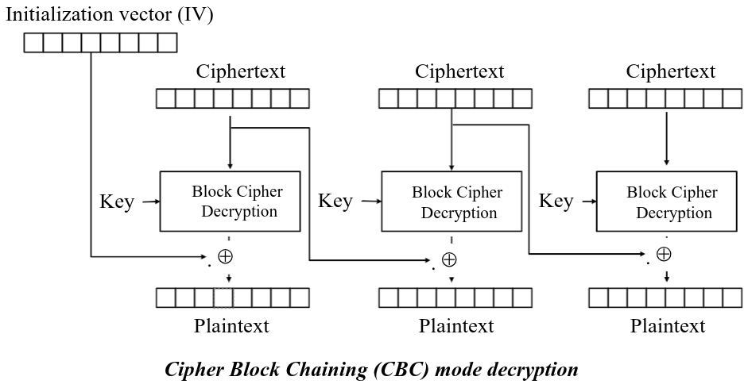
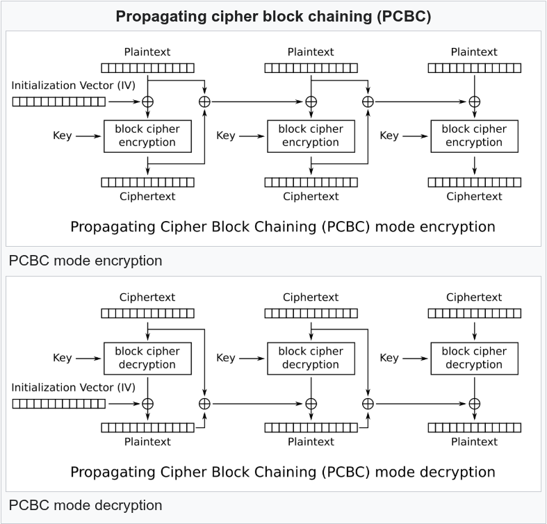
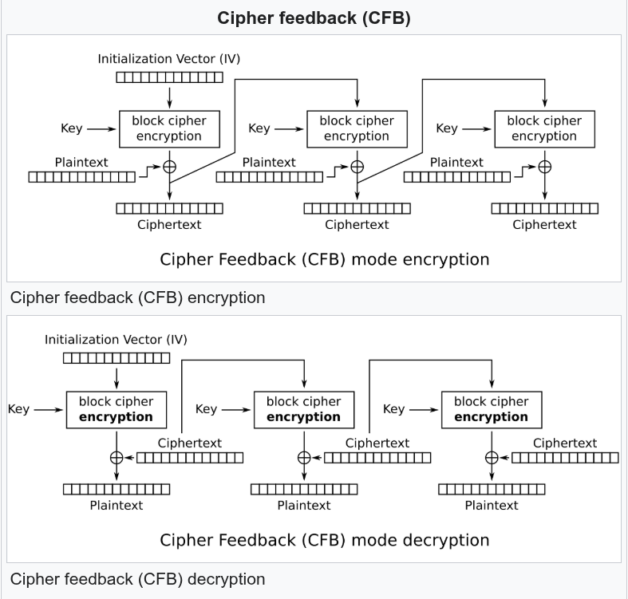
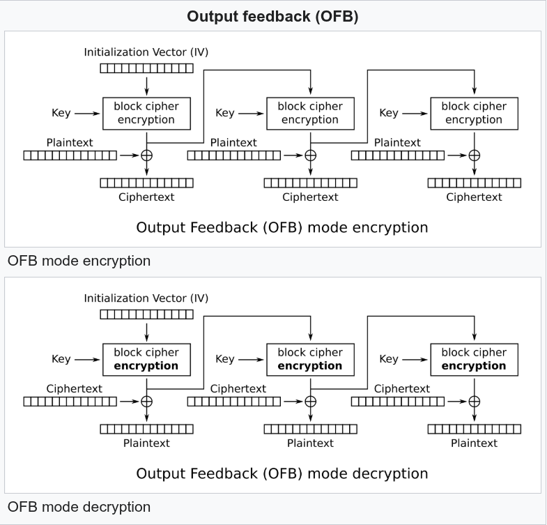
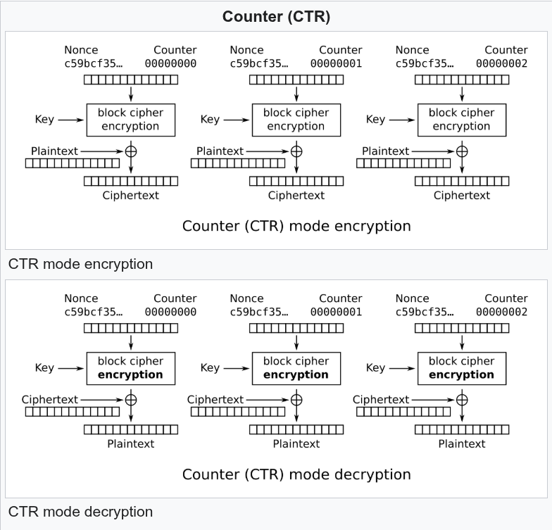

# 1. Why Modes of Operation Exist

A block cipher like AES encrypts exactly one fixed-size block — 128 bits — at a time. But real-world data is almost never exactly 128 bits. A file, a network packet, a database record — these can be kilobytes or megabytes long.

So the question is: **how do you apply a block cipher to a message that spans many blocks?**

The naive answer is: encrypt each block separately with the same key. That works, but as we'll see, it is catastrophically insecure. A **Mode of Operation** is the formal definition of *how* you chain the block cipher across multiple blocks of data.

Think of the block cipher itself (AES, DES) as a padlock mechanism — it can lock and unlock one box at a time. The Mode of Operation is the *strategy* you use to transport an entire truck of boxes securely.

Every mode answers the same two questions:
1. How does encrypting block $i$ depend on what happened at block $i-1$?
2. How does the key get mixed into each block?

Different answers produce very different security properties.

<div align="center">
    
</div>

---

# 2. ECB — Electronic Codebook

## How It Works

ECB is the naive approach: split the plaintext into blocks, and encrypt each block independently with the same key.

$$
c_i = E_K(m_i)\\
m_i = D_K(c_i)
$$

Each block goes straight into the cipher with no memory of what came before.

## Properties

**Encryption:** Parallel; **Decryption:** Parallel; **Random access:** decrypt any block independently; **Requires padding:** yes, **IV/Nonce needed:** No

## The Fatal Flaw

ECB is **deterministic**: the same plaintext block, under the same key, always produces the same ciphertext block. This completely violates the goal of diffusion.

The classic demonstration is the **ECB Penguin**. Take a bitmap image of a Linux penguin (Tux) and encrypt it with AES-ECB. The pixels of the penguin's black body all encrypt to the same ciphertext. The pixels of the white belly all encrypt to the same ciphertext. The resulting "encrypted" image still shows the outline of the penguin — perfectly recognizable.

<div align="center">
    
</div>

This happens because ECB reveals the structure of the plaintext. An attacker who sees two identical ciphertext blocks immediately knows the corresponding plaintext blocks are also identical — and that's a lot of information.

> ECB should **never** be used for encrypting more than one block of data. It is only appropriate when you are encrypting a single, isolated, random-looking block (e.g., a random key).

## Challenge

Suppose a login system encrypts user roles with AES-ECB: `ADMIN_______` and `USER________` (padded to 16 bytes each). An attacker has two accounts — one `ADMIN` and one `USER`. They can see their own ciphertext tokens.

<u>How could an attacker use ECB's weakness to escalate their `USER` token to an `ADMIN` token without knowing the key?</u>

Because ECB is deterministic, encrypting the same plaintext block always gives the same ciphertext. The attacker logs in as `ADMIN`, captures their ciphertext, then replaces their `USER` ciphertext with the captured `ADMIN` ciphertext. The server decrypts it and sees `ADMIN`. The attacker just performed a **cut-and-paste attack** — rearranging or substituting ciphertext blocks to manipulate the decrypted meaning — with zero knowledge of the key.

---

# 3. CBC — Cipher Block Chaining

## How It Works

CBC fixes ECB's determinism by **chaining** each plaintext block to the previous ciphertext block before encryption. This creates a dependency chain: the ciphertext of block $i$ depends on all previous plaintext blocks.

$$
c_i = E_K(m_i \oplus c_{i-1})\\
m_i = D_K(c_i) \oplus c_{i-1}
$$

For the very first block, there is no "previous ciphertext." So CBC introduces an **Initialization Vector (IV)**: a random 128-bit value that plays the role of $c_0$.

$$
c_0 = IV\\
c_1 = E_K(m_1 \oplus c_0)
$$

<div align="center">
    
</div>

---

<div align="center">
    
</div>

## The Role of the IV

The IV must be:
- **Random and unpredictable** — a predictable IV (e.g., a counter) can be exploited
- **Different for every message** encrypted under the same key
- **Not secret** — the IV is typically sent alongside the ciphertext; security does not depend on its secrecy

If the same key and IV pair is ever reused, an attacker who sees both ciphertexts can XOR them together and extract information about the difference between the two plaintexts.

## Properties

**Encryption:** Serial - each block needs previous ciphertext; **Decryption:** Parallel - already have all ciphertext blocks; **Random access:** partial - can decrypt block $i$ if have block $i - 1$; **Padding required:** yes; **IV/Nonce needed:** yes.

## Error Propagation

A single flipped bit in ciphertext block $c_i$ will:
1. Completely garble the decryption of block $m_i$ (a 128-bit block becomes random noise)
2. Flip exactly the corresponding bit in block $m_{i+1}$ (from the XOR step)
3. Leave all subsequent blocks $m_{i+2}, m_{i+3}, \ldots$ **unaffected**

This limited cascade is a useful property in some protocols.

## Challenge

CBC encryption is strictly serial — you cannot encrypt block 5 until you have the ciphertext of block 4. Yet CBC decryption is fully parallel.

<u>Why can decryption be parallelized even though encryption cannot?</u>

Because the decryption formula is $m_i = D_K(c_i) \oplus c_{i-1}$. At decryption time, **all** ciphertext blocks $c_1, c_2, \ldots, c_n$ are already known — they were received in full. So you can compute $D_K(c_i)$ for every $i$ simultaneously on separate processors, then XOR each with its predecessor. There are no forward dependencies. During encryption, $c_i$ depends on $c_{i-1}$, which doesn't exist until block $i-1$ finishes — hence serial.

## Propagating Cipher Block Chaining (PCBC)

The PCBC was designed to cause small changes in the ciphertext to propagate indefinitely when decrypting, as well as when encrypting. 

In PCBC mode, each block of plaintext is XORed with both the previous plaintext block and the previous ciphertext block before being encrypted.

Like with CBC mode, an initialization vector is used in the first block. Unlike CBC, decrypting PCBC with the incorrect IV (initialization vector) causes all blocks of plaintext to be corrupt.

<div align="center">
    
</div>

---

# 4. CFB — Cipher Feedback

## How It Works

CFB turns the block cipher into a **self-synchronizing stream cipher**. Instead of encrypting the plaintext directly, you encrypt the *previous ciphertext* to generate a keystream, then XOR the keystream with the plaintext.

$$
z_i = E_K(c_{i-1}) \quad \text{(keystream block)}\\
c_i = m_i \oplus z_i \quad \text{(encryption)}\\
m_i = c_i \oplus E_K(c_{i-1}) \quad \text{(decryption)}
$$

For the first block: $c_0 = IV$.

<div align="center">
    
</div>

## Key Insight: No Decryption Function Needed

Notice that both encryption and decryption use $E_K$ (the block cipher's *encryption* direction). The cipher's decryption function $D_K$ is never called. This matters for constrained devices or hardware where implementing the full inverse cipher is costly.

## CFB Sub-modes

Full CFB operates on one block (128 bits) at a time. But it can be adapted to operate on smaller units — **CFB-8** processes one byte at a time, making it useful for protocols that need byte-level streaming. In CFB-8, only 8 bits of the 128-bit keystream block are used per step, making it slower but more flexible.

## Properties

**Encryption:** Serial; **Decryption:** Parallel; **Padding required:** No; **IV/Nonce needed:** Yes. If reuse $\rightarrow$ leaks information.

---

# 5. OFB — Output Feedback

## How It Works

OFB also generates a keystream, but unlike CFB, the keystream is generated **entirely independently of the plaintext and ciphertext**. It only depends on the IV and the key.

$$
z_0 = IV\\
z_i = E_K(z_{i-1}) \quad \text{(keystream block)}\\
c_i = m_i \oplus z_i \quad \text{(encryption)}\\
m_i = c_i \oplus z_i \quad \text{(decryption)}\\
$$

<div align="center">
    
</div>

## The Pre-computation Advantage

Because the keystream $z_1, z_2, z_3, \ldots$ depends only on the key and IV — not the actual data — **it can be pre-computed before the message is even known**. In systems where messages arrive unpredictably and encryption latency matters, you can generate the keystream in advance and then XOR it with data as it arrives.

## Error Propagation

OFB has a clean error propagation profile: a single flipped bit in $c_i$ only flips the corresponding bit in $m_i$. It does **not** cascade to later blocks, because the keystream generator is insulated from ciphertext errors. This makes OFB attractive for noisy channels (e.g., satellite links) where bit errors are expected.

## The Critical Weakness: IV Reuse

If the same key and IV are ever used for two different messages, both messages are XOR'd with the **identical keystream**. This is a **two-time pad**. An attacker who intercepts both ciphertexts $c$ and $c'$ can compute $c \oplus c' = m \oplus m'$, which directly reveals the XOR of the two plaintexts — and from that, recovering both messages with modest effort is often practical.

## Properties

**Encryption:** Serial (but keystream pre-computable); **Decryption:** Serial (same keystream generation); **Padding required:** No; **Error propagation:** Isolated (no cascading); **IV/Nonce needed:** Yes. If reused $\rightarrow$ breaks the system security.

---

# 6. CTR — Counter Mode

## How It Works

CTR mode is the most modern and widely recommended of the classic modes. Like OFB, it generates a keystream and XORs it with the data. But instead of chaining encrypted outputs, it generates each keystream block by encrypting a **unique counter value**.

$$T_i = \text{Nonce} \| \text{Counter}_i \quad \text{(128-bit input block)}\\
c_i = m_i \oplus E_K(T_i)\\
m_i = c_i \oplus E_K(T_i)$$

The nonce is a random value chosen for this message (role of nonce same as IV). The counter starts at 0 (or 1) and increments by 1 for each block.

<div align="center">
    
</div>

## Why CTR is Preferred

**Full parallelism**: Because each $T_i$ is independent (block 5 doesn't need block 4's output), every block can be encrypted or decrypted simultaneously on separate processors. This makes CTR extremely fast on modern multi-core hardware.

**Random access**: To decrypt block $i$ of a large encrypted file, you don't need to decrypt all preceding blocks. Just compute $E_K(T_i)$ directly and XOR with $c_i$. This is invaluable for encrypted databases and disk encryption.

**Only uses $E_K$**: Like CFB and OFB, CTR never calls the block cipher's decryption function.

**No padding needed**: CTR generates a keystream bit-by-bit (conceptually), so you simply XOR however many bytes you need and discard the rest. No need to extend the message.

## The Critical Rule: Never Reuse (Key, Nonce) Pairs

CTR's security collapses completely if a nonce is ever reused with the same key. Two ciphertexts encrypted with the same counter and key XOR to the XOR of the plaintexts — the same catastrophic two-time pad vulnerability as OFB. The nonce must be unique for every single message.

## Properties Summary: All Modes Side by Side

| Mode | Parallel Enc | Parallel Dec | Random Access | Padding Needed | Uses $D_K$ | IV/Nonce |
|---|:---:|:---:|:---:|:---:|:---:|:---:|
| ECB | ✓ | ✓ | ✓ | Yes | Yes | No |
| CBC | ✗ | ✓ | Partial | Yes | Yes | Random IV |
| CFB | ✗ | ✓ | Partial | No | No | Random IV |
| OFB | Pre-compute | Pre-compute | ✗ | No | No | Unique IV |
| CTR | ✓ | ✓ | ✓ | No | No | Unique Nonce |

## Challenge

ECB, CBC, CFB, OFB, and CTR are all "unauthenticated" modes — they provide **confidentiality** (the attacker cannot read the message) but not **integrity** (the attacker can silently flip bits in the ciphertext, and the receiver will decrypt it without knowing anything was tampered with).

<u>Why is confidentiality alone insufficient for a secure communication system?</u>

Consider CBC-encrypted network traffic. An attacker intercepts $c_3$ and flips a specific bit. The receiver decrypts: block $m_3$ becomes garbled noise, but block $m_4$ has exactly one bit flipped — a surgical, invisible change. If $m_4$ contains a payment amount or a recipient account number, the attacker may have modified a real transaction with no detectable trace. Confidentiality stops the attacker from *reading* the data; it does not stop them from *modifying* it. A complete security system needs both — which is exactly what **Authenticated Encryption** modes provide.

---

# 7. Padding

Modes like ECB and CBC operate on full 128-bit (AES) or 64-bit (DES) blocks. But plaintext messages are almost never an exact multiple of the block size. If your last block is only 100 bits of a 128-bit block, what goes in the other 28 bits?

**Padding** is the answer: you extend the final plaintext block to the required length using a defined scheme, and the receiver knows how to strip the padding after decryption to recover the original message.

The most important property of any padding scheme: it must be **unambiguous**. Given a decrypted padded message, there must be exactly one way to interpret where the padding ends and the real data begins.

> Modes that generate a keystream (CFB at sub-block level, OFB, CTR) do not need padding — you simply XOR as many bytes as the message contains and stop. Padding only matters for block-by-block modes (ECB, CBC).

## Bit Padding (ISO/IEC 7816-4)

The rule is simple:
1. Append a single **`1` bit** immediately after the last bit of the message.
2. Fill the rest of the block with **`0` bits**.

**Example:** Message ends with 5 bytes (`...XX XX XX XX XX`) in a 8-byte block:

```
Message (5 bytes):   XX XX XX XX XX
After bit padding:   XX XX XX XX XX 80 00 00
```

`80` in hex is `10000000` in binary — the leading `1` is the required padding bit, followed by seven `0` bits to fill the block.

**What if the message already fills a full block exactly?** A full padding block must be added:

```
Full 8-byte message:  XX XX XX XX XX XX XX XX
After bit padding:    XX XX XX XX XX XX XX XX | 80 00 00 00 00 00 00 00
```

The extra block exists because without it, the `1` bit has nowhere to go, and removal is ambiguous.

**Removing bit padding:** Scan from the end of the decrypted data backwards. Strip all `0` bits. Then strip the single `1` bit. What remains is the original message.

## PKCS#5 and PKCS#7 Byte Padding

This is the most widely used padding scheme in practice, used by AES in CBC mode in TLS, Java, Python's `cryptography` library, and many others.

**PKCS#5** was originally defined for 8-byte blocks (DES).
**PKCS#7** is the generalization to any block size, including AES's 16-byte blocks. In practice, people use the names interchangeably.

**The rule:**
- Let $N$ = the number of padding bytes needed to fill the last block.
- Append exactly $N$ bytes, each with the **byte value $N$**.
- $N$ is always between 1 and the block size (inclusive). It is never 0.

**Examples for a 8-byte block:**

| Message length (mod 8) | Padding bytes needed ($N$) | Padding appended |
|---|---|---|
| 5 bytes | 3 | `03 03 03` |
| 6 bytes | 2 | `02 02` |
| 7 bytes | 1 | `01` |
| 0 bytes (full block) | 8 | `08 08 08 08 08 08 08 08` |

Notice: when the message fills a complete block, you still append an entire extra block of padding (all bytes equal to the block size value). This is mandatory — it ensures that removing padding is always unambiguous.

**Examples for AES (16-byte block):**

| Scenario | Last block (before padding) | After PKCS#7 |
|---|---|---|
| 13 bytes in last block | `AA BB CC DD ... (13 bytes)` | `AA BB CC DD ... 03 03 03` |
| 1 byte in last block | `AA` | `AA 0F 0F 0F 0F 0F 0F 0F 0F 0F 0F 0F 0F 0F 0F 0F` |
| 16 bytes (full block) | `AA BB ... PP (16 bytes)` | Full block + `10 10 10 ... 10` (16 bytes of `0x10`) |

**Removing PKCS#7 padding:** Read the last byte. Its value is $N$. Verify that the last $N$ bytes are all equal to $N$. Strip them. If verification fails, the padding is invalid — raise an error.

> The verification step is security-critical. Silently ignoring invalid padding enables **padding oracle attacks** (like the POODLE attack on SSL 3.0), where an attacker can decrypt ciphertext by repeatedly sending crafted messages and observing whether the server reports a padding error.

## Side-by-side Comparison

| Scheme | Unit | What is appended | Overhead | Block size |
|---|---|---|---|---|
| Bit padding | Bits | `1` followed by `0`s | 1–block bits | Any |
| PKCS#5 | Bytes | $N$ bytes of value $N$ | 1–8 bytes | 8 bytes (DES) |
| PKCS#7 | Bytes | $N$ bytes of value $N$ | 1–block bytes | Any (AES: 16) |

---

# 8. Authenticated Encryption (AEAD)

The modes above (ECB through CTR) only provide **confidentiality** — they hide the content of the message. But they offer no guarantee that the ciphertext wasn't tampered with in transit.

Modern systems need **Authenticated Encryption with Associated Data (AEAD)**: a single scheme that simultaneously provides:
- **Confidentiality**: the plaintext is hidden
- **Integrity**: any modification to the ciphertext is detectable
- **Authentication**: the receiver can verify the message came from someone with the correct key

AEAD modes also support **Associated Data (AD)**: additional data that is *authenticated but not encrypted* (e.g., a packet header, a version number, a recipient ID). The receiver verifies the AD was not modified, but it remains readable in plaintext.

The output of an AEAD mode is the ciphertext plus an **authentication tag** — typically 128 bits — that the receiver checks before accepting the message. If the tag doesn't match (because the ciphertext or AD was altered), decryption is rejected entirely.

## GCM — Galois/Counter Mode

GCM is the dominant AEAD mode today, used in TLS 1.3, SSH, and most modern secure protocols. It combines two components:

1. **CTR mode** for encryption — the plaintext is XOR'd with a keystream generated by encrypting a counter with the key
2. **GHASH** for authentication — a polynomial hash function over GF(2¹²⁸) that produces the authentication tag

The key insight is that both steps are highly parallelizable. GHASH's GF(2¹²⁸) multiplication maps directly to hardware instructions on modern CPUs (`PCLMULQDQ` on x86), making GCM-AES extremely fast — often faster than CTR alone due to hardware acceleration.

**Parameters:**
- IV/Nonce: 96 bits (recommended; other lengths are supported but treated differently)
- Authentication tag: up to 128 bits (128 recommended; shorter tags reduce security)

**Critical weakness:** GCM is catastrophically broken if a nonce is ever reused with the same key. Nonce reuse allows an attacker to recover the authentication key (the GHASH key), enabling them to forge authentication tags for arbitrary messages. This is called **nonce misuse**.

## CCM — Counter with CBC-MAC

CCM combines two well-understood primitives:
- **CTR mode** for encryption
- **CBC-MAC** for authentication

CCM is a **two-pass algorithm**: it first computes the CBC-MAC over the plaintext, then encrypts both the plaintext (CTR) and the MAC (also with CTR, using a different counter value). This means the message length must be known **before** processing starts — it cannot handle streaming data.

**Where it's used:** CCM was adopted for resource-constrained environments:
- IEEE 802.11i (WPA2 personal/enterprise — CCMP)
- Bluetooth LE
- ZigBee / IEEE 802.15.4
- IPsec

The appeal is that CCM requires only **one underlying primitive** (the block cipher in encryption mode) to achieve both confidentiality and authentication — simple to implement on tiny hardware with limited code space.

**Limitation:** The two-pass structure and the length-prefix requirement make CCM harder to use for streaming or unknown-length data.

## EAX

EAX was designed as a clean, patent-free alternative to OCB that is simpler to specify and implement correctly. It combines:
- **CTR mode** for encryption
- **OMAC** (a.k.a. CMAC — a CBC-MAC variant that handles variable-length messages cleanly) for authentication, applied to the nonce, the associated data, and the ciphertext independently, then XOR'd

**Key properties:**
- **Two-pass**: applies CTR and OMAC separately, so it needs two passes over the data — slightly slower than OCB
- **Streaming-friendly**: unlike CCM, you do not need to know the message length in advance
- **Provably secure**: tight security reduction to the underlying block cipher
- **Patent-free**: unlike early OCB
- **No padding needed**: OMAC handles messages of any length; CTR generates exact-length keystreams

EAX is not as widely deployed as GCM, but it is used in some embedded and IoT protocols.

## OCB — Offset Codebook Mode

OCB is the *fastest* AEAD mode. Where GCM and EAX need two passes over the data (encrypt + authenticate separately), OCB integrates both into a **single pass**. This gives it throughput that is barely more expensive than raw CTR mode — essentially "free" authentication.

OCB works by encrypting each message block with a special, block-dependent **offset** value derived from the key and a nonce, then accumulating a checksum for authentication.

**Key properties:**
- **Single-pass**: encryption and authentication happen together; the tag is computed alongside the ciphertext
- **Fastest AEAD**: practically the same speed as unauthenticated CTR on hardware without AES-GCM acceleration
- **Patent situation**: OCB 1.0 and 2.0 had patents (now expired in most jurisdictions). OCB 3.0 has a royalty-free license grant for most uses
- **Less widespread adoption**: due to the historical patent situation, TLS and most internet protocols standardized on GCM instead

**When to use**: OCB is the right choice for high-throughput applications on hardware without AES-GCM native support, or in environments where latency is critical.

## Summary: AEAD Modes Side by Side

| Mode | Passes | Streaming | Nonce Misuse | Hardware Accel | Common Usage |
|---|:---:|:---:|---|:---:|---|
| GCM | Single (pipelined) | Yes | Catastrophic | ✓ (GHASH) | TLS 1.3, SSH, HTTPS |
| CCM | Two | No (needs length) | Severe | Partial | WPA2, Bluetooth LE |
| EAX | Two | Yes | Severe | No | IoT, embedded |
| OCB | One | Yes | Severe | No | High-speed apps |

---

# 9. OAEP — Optimal Asymmetric Encryption Padding

Everything covered so far has been about **symmetric** encryption (AES, DES). OAEP is different — it is a padding scheme for **RSA**, an asymmetric cipher.

## Why RSA Needs Padding

Raw "textbook" RSA encryption is:
$$c = m^e \pmod{n}$$

This is deterministic: encrypting the same message $m$ with the same public key $(e, n)$ always gives the same ciphertext $c$. This means:
- An attacker can **enumerate** possible messages (e.g., "YES" or "NO") and encrypt them to see which one matches an intercepted ciphertext
- RSA has known **homomorphic** properties that allow attackers to forge ciphertexts from others
- Small messages have exploitable mathematical structure

Textbook RSA is **never safe to use directly** for encrypting real data.

## What OAEP Does

OAEP (defined in PKCS#1 v2.x, also known as RSAES-OAEP) transforms the plaintext before applying RSA, using two hash-based operations:

1. **Encode the message with randomness**: A random seed $r$ is combined with the message $m$ and a hash function $H$ through a **Mask Generation Function (MGF)** to produce a structured, randomized encoding of $m$.
2. **Apply RSA to the padded block**: The encoded block is treated as the RSA plaintext $m'$, and RSA encryption proceeds as $c = (m')^e \pmod{n}$.

<div align="center">
<!--  -->
    
</div>

The encoding scheme ensures:
- **Randomization**: every encryption of the same message $m$ produces a different ciphertext, because the seed $r$ is chosen fresh each time
- **All-or-nothing**: you cannot partially decode the message without knowing everything — a tiny error in the RSA decryption produces complete garbage, preventing adaptive chosen-ciphertext attacks
- **Label binding**: an optional label string $L$ (empty by default) is hashed and embedded, allowing the ciphertext to be bound to a specific context or usage

## Decryption

The receiver uses their private key $(d, n)$ to compute $m' = c^d \pmod{n}$, then runs the OAEP **decoding** (the inverse of the encoding) to recover the original message $m$ and verify the structural integrity of the padding.

If the padding structure is malformed — because the ciphertext was tampered with, or an incorrect key was used — decryption fails explicitly.

## Security Guarantees

OAEP is proven **IND-CCA2 secure** (indistinguishable under adaptive chosen-ciphertext attack) in the random oracle model. This is the strongest standard security property for an encryption scheme. Textbook RSA doesn't come close.

> OAEP is **the correct way to use RSA for encryption**. Any system using raw, unpadded RSA to encrypt data is fundamentally broken.

## Quick Comparison: Padding Contexts

| Scheme | Used With | Purpose |
|---|---|---|
| Bit padding | Block ciphers (CBC/ECB) | Fill last plaintext block to block boundary |
| PKCS#7 | Block ciphers (CBC/ECB) | Fill last plaintext block — widely standard |
| OAEP | RSA | Add randomness and structure to prevent textbook RSA attacks |
